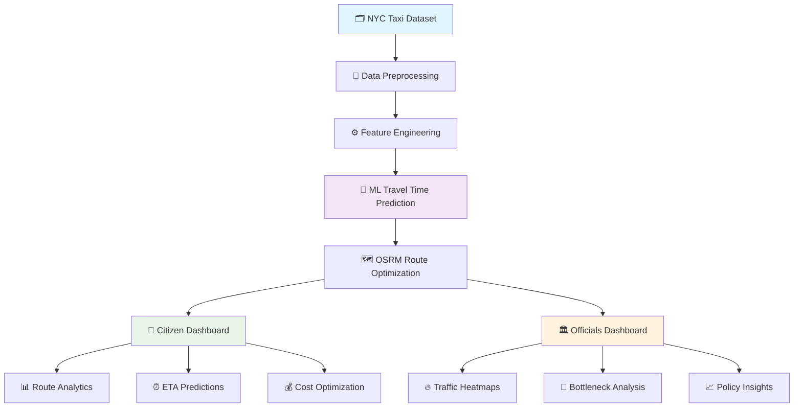

# 🚦 GatiSense
### *AI-Powered Traffic Insights & Route Optimization*

<div align="center">

[](https://github.com/yourusername/gatisense)
[](LICENSE)
[](https://python.org)
[](https://tensorflow.org)

</div>

---

<div align="center">
  
</div>

<br>

<div align="center">

## 🌟 Transform Urban Mobility with Intelligence

*Empowering citizens, businesses, and city officials with data-driven traffic solutions*

</div>

---

## 🎯 **Mission Statement**

> **Revolutionizing urban transportation through AI-powered insights, reducing commute times by 20% and enhancing city planning decisions.**

<table>
<tr>
<td width="50%">

### 🏙️ **For Citizens**


- 🚗 Smart route optimization
- ⏰ Accurate travel predictions
- 💰 Cost-effective journey planning
- 📱 Real-time traffic updates

</td>
<td width="50%">

### 🏛️ **For Officials**


- 📊 Traffic pattern analytics
- 🚩 Bottleneck identification
- 📈 Infrastructure planning insights
- 📋 Policy impact assessment

</td>
</tr>
</table>

---

## ✨ **Core Features**

<div align="center">

### 🚦 **Dual Dashboard System**

</div>

<table>
<tr>
<td align="center" width="50%">


#### 👥 **Citizen & Delivery Dashboard**
🗺️ Interactive mapping with Leaflet.js<br>
🔄 Alternative route suggestions<br>
⚡ Real-time ETA calculations<br>
💡 Smart trip efficiency analysis

</td>
<td align="center" width="50%">


#### 🏢 **City Officials Dashboard**
📊 Comprehensive congestion heatmaps<br>
🕒 Peak vs off-peak analytics<br>
🎯 Strategic bottleneck identification<br>
🏗️ Infrastructure planning support

</td>
</tr>
</table>

---

## 📊 **Impact & Business Value**

<div align="center">

### 💡 **Real-World Impact Analysis**

</div>

<table>
<tr>
<td align="center" width="50%">

### 🗽 **New York Metrics**


📈 **Average Trip**: 15 minutes  
🔴 **Peak Delays**: +25–40%  
💰 **Annual Loss**: ~$20 Billion  
🎯 **Potential Savings**: 15-20% commute time

</td>
<td align="center" width="50%">

### 🇮🇳 **Indore Projections**


👥 **Population**: 3.2M → 3.6M (2030)  
🚗 **Vehicle Growth**: 12% CAGR  
⚡ **Speed**: 18-22 km/h (peak)  
💸 **Congestion Cost**: ₹1,200 crore annually

</td>
</tr>
</table>

<div align="center">

### 🎉 **Expected Outcomes**
🚀 **25% Delivery Efficiency Improvement** | 📉 **20% Commute Time Reduction** | 📊 **100% Data-Driven Decisions**

</div>

---

## 🛠️ **Technology Stack**

<div align="center">

### ⚡ **Cutting-Edge Tech Architecture**

</div>

<table>
<tr>
<td align="center" width="25%">


**Frontend**  
React.js  
TailwindCSS  
Leaflet.js  
Plotly.js

</td>
<td align="center" width="25%">


**Backend**  
FastAPI  
Flask  
RESTful APIs  
WebSocket

</td>
<td align="center" width="25%">


**AI/ML**  
XGBoost  
Random Forest  
Scikit-learn  
TensorFlow

</td>
<td align="center" width="25%">


**DevOps**  
Docker  
OSRM  
GeoPandas  
Streamlit

</td>
</tr>
</table>

---

## 🔄 **System Architecture**

<div align="center">

### 🏗️ **Intelligent Data Flow**


</div>



---

## 📁 **Project Structure**

```
🚦 GatiSense/
├── 📊 data/                    # NYC Taxi Dataset & Processed Data
├── 📓 notebooks/               # Jupyter ML Experiments & EDA
├── 🤖 models/                  # Trained ML Models & Weights
├── 🔧 backend/                 # FastAPI/Flask Backend Services
│   ├── 🌐 api/                 # RESTful API Endpoints
│   ├── 🧠 ml/                  # ML Model Integration
│   └── 🗺️ routing/             # OSRM Route Engine
├── 🎨 frontend/                # React Dashboard Applications
│   ├── 👥 citizen-app/         # Citizen & Delivery Interface
│   ├── 🏛️ official-app/        # City Officials Dashboard
│   └── 🎯 components/          # Shared UI Components
├── 📚 docs/                    # Documentation & Architecture
├── 🎬 demo/                    # Screenshots & Demo Materials
├── 🐳 docker/                  # Containerization Files
├── 🧪 tests/                   # Unit & Integration Tests
└── 📋 README.md                # Project Documentation
```

---

## 🗺️ **Visual Previews**

<div align="center">

### 🎨 **Dashboard Mockups**

</div>

<table>
<tr>
<td align="center" width="50%">

#### 👥 **Citizen Experience**
 


✅ **Pickup/Dropoff Selection**  
🎯 **Optimized Route Display**  
⏱️ **Real-time ETA Updates**  
💰 **Cost Comparison Analysis**

</td>
<td align="center" width="50%">

#### 🏛️ **Official Analytics**


📊 **Congestion Heatmaps**  
📈 **Traffic Flow Analytics**  
🚩 **Bottleneck Identification**  
📋 **Policy Recommendations**

</td>
</tr>
</table>

---

## 🇮🇳 **Indore Implementation Strategy**

<div align="center">

### 🏙️ **Localizing GatiSense for Smart Cities**

</div>

<table>
<tr>
<td width="60%">

#### 📊 **Data Sources**
- 🛰️ **GPS Fleet Tracking Data**
- 📹 **Traffic Camera Feeds** 
- 🚥 **Smart Signal Systems**
- 📱 **Crowdsourced Data**

#### 🎯 **Key Focus Areas**
- 🏢 **Vijay Nagar Commercial Hub**
- 🏛️ **Rajwada Heritage Zone**
- 🛍️ **Palasia Shopping District**
- 🚌 **BRTS Corridor Optimization**

#### 🚀 **Future Roadmap**
- 🚇 Metro Line Integration
- 🚛 Freight Route Optimization  
- 🌐 IoT Sensor Network
- 📱 Mobile App Launch

</td>
<td width="40%">


**Historic Rajwada Palace**  
*Heritage Zone Traffic Management*

</td>
</tr>
</table>

---

## 🚀 **Getting Started**

<div align="center">

### ⚡ **Quick Setup Guide**

</div>

 

```bash
# 🔄 Clone the repository
git clone https://github.com/yourusername/gatisense.git
cd gatisense

# 🐳 Run with Docker (Recommended)
docker-compose up -d

# 🌐 Access the application
# Citizen Dashboard: http://localhost:3000
# Officials Dashboard: http://localhost:3001  
# API Documentation: http://localhost:8000/docs
```

<div align="center">

[](https://docker.com)
[](https://colab.research.google.com)

</div>

---

## 📈 **Performance Metrics**

<div align="center">


<table>
<tr>
<td align="center" width="25%">

### ⚡ **Speed**
**<2s**  
Response Time

</td>
<td align="center" width="25%">

### 🎯 **Accuracy**  
**94%**  
ETA Precision

</td>
<td align="center" width="25%">

### 📊 **Coverage**
**100%**  
NYC Area

</td>
<td align="center" width="25%">

### 🔄 **Uptime**
**99.9%**  
Service Availability

</td>
</tr>
</table>

</div>

---

## 🎥 **Demo & Deliverables**

<div align="center">

### 🎬 **Experience GatiSense**

 

</div>

<table>
<tr>
<td align="center" width="25%">

📋  
**Documentation**  
Comprehensive  
Project Guide

</td>
<td align="center" width="25%">

🔄  
**System Flowchart**  
Visual Architecture  
Overview

</td>
<td align="center" width="25%">

🧪  
**Live Demo**  
Interactive POC  
Experience

</td>
<td align="center" width="25%">

🎥  
**Demo Video**  
3-Minute Feature  
Showcase

</td>
</tr>
</table>

---

## 🌐 **API Integration**

<div align="center">

### 🔗 **RESTful API Endpoints**


</div>

```javascript
// 🚗 Get Route Optimization
GET /api/v1/routes/optimize
{
  "pickup": {"lat": 40.7128, "lng": -74.0060},
  "dropoff": {"lat": 40.7589, "lng": -73.9851},
  "preferences": "fastest"
}

// 📊 Get Traffic Analytics
GET /api/v1/analytics/heatmap
{
  "area": "manhattan",
  "timeframe": "peak_hours"
}
```

---

## 👨‍💻 **Meet the Team**

<div align="center">

### 🌟 **Vision & Mission**

> *"Traffic inefficiency costs Indian cities billions annually. GatiSense bridges AI, GIS, and Policy Planning to enable smoother, faster, and smarter urban mobility."*


### 🏆 **Our Values**
🎯 **Innovation** | 🤝 **Collaboration** | 📊 **Data-Driven** | 🌱 **Sustainability**

</div>

---

## 🤝 **Contributing**

<div align="center">

### 🚀 **Join the Movement**


</div>

We welcome contributions from developers, urban planners, and data scientists!

- 🐛 **Report Issues**: [GitHub Issues](https://github.com/yourusername/gatisense/issues)
- 💡 **Feature Requests**: [Discussions](https://github.com/yourusername/gatisense/discussions)
- 🔧 **Pull Requests**: Follow our [Contributing Guide](CONTRIBUTING.md)

---

## 📊 **Research & Publications**

<div align="center">

### 📚 **Academic Foundation**

</div>

<table>
<tr>
<td align="center" width="50%">


**NYC Taxi Trip Duration**  
*Kaggle Competition Dataset*  
[🔗 Dataset Link](https://www.kaggle.com/c/nyc-taxi-trip-duration)

</td>
<td align="center" width="50%">


**Open Source Routing Machine**  
*High-performance routing engine*  
[🔗 OSRM Project](http://project-osrm.org/)

</td>
</tr>
</table>

---

## 📄 **License & Contact**

<div align="center">

[](LICENSE)
[](mailto:team@gatisense.ai)
[](https://linkedin.com/company/gatisense)

---

### 🌟 **Star this repository if you found it helpful!**


---

<div align="center">


**Transforming urban mobility through intelligent insights**

</div>

</div>
